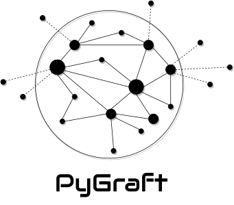
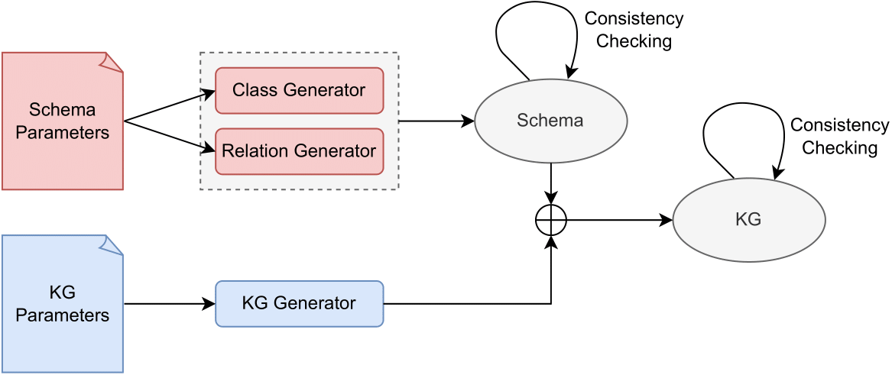

<p align="center">
  
</p>

<p align="center">
  <a href='https://opensource.org/licenses/MIT'>
    
  </a>

  <a href="https://pypi.org/project/pygraft/" alt="PyPI">
    
  </a>

  <a href="https://pypi.org/project/pygraft" alt="pypi downloads">
    
  </a>

  <a href="https://github.com/psf/black">
    
  </a>
</p>

# [PyGraft: Configurable Generation of Synthetic Schemas and Knowledge Graphs at Your Fingertips](https://arxiv.org/pdf/2309.03685.pdf)

This is the open-source implementation of PyGraft, initially presented in [this paper](https://arxiv.org/pdf/2309.03685.pdf).

PyGraft is an open-source Python library for generating synthetic yet realistic schemas and (KGs) based on user-specified parameters. The generated resources are domain-agnostic, i.e. they are not tied to a specific application field.

Being able to synthesize schemas and KGs is an important milestone for conducting research in domains where data is sensitive or not readily available. PyGraft allows researchers and practitioners to generate schemas and KGs on the fly, provided minimal knowledge about the desired specifications. 

PyGraft has the following features:
- possibility to generate a schema, a KG, or both
- highly-tunable process based on a broad array of user-specified parameters
- schemas and KGs are built with an extended set of RDFS and OWL constructs
- logical consistency is ensured by the use of a DL reasoner (HermiT)

## Installation

The latest stable version of PyGraft can be downloaded and installed from [PyPI](https://pypi.org/project/pygraft) with:

```bash
pip install pygraft
```

The latest version of PyGraft can be installed directly from [GitHub](https://github.com/nicolas-hbt/pygraft) source with:

```bash
pip install git+https://github.com/nicolas-hbt/pygraft.git
```

## Upcoming Features

Additional features will be provided in the next versions of PyGraft. To name but a few:

**High Priority**

- [ ] Allow support for any input schema (and not only the schemas generated by PyGraft).
- [ ] Allow explanations for inconsistencies to be parsed from HermiT API. This would make it possible to remove a subset of triples from inconsistent KGs to make them consistent, without needing the user to run the KG generation pipeline again. This is especially true for very large graphs, or if the user comes with an already existing schema which is not perfectly consistent.

**Medium Priority**

- [ ] Fix the conflict between the following properties ``rdfs:subPropertyOf``, ``owl:FunctionalProperty``, and ``owl:InverseFunctionalProperty``, as a non-zero value for the three of them at the same time can lead to inconsistent KGs.

**Low Priority**

- [ ] Facilitate the generation of larger KGs (this would imply removing any dependency to [rdflib](https://github.com/RDFLib/rdflib/)).
- [ ] Add support for literals.

## PyGraft Overview

The contributions of PyGraft are as follows:

- To the best of our knowledge, PyGraft is the first generator able to synthesize both schemas and KGs in a single pipeline.

- The generated schemas and KGs are described with an extended set of RDFS and OWL constructs, allowing for both fine-grained resource descriptions and strict compliance with common Semantic Web standards.

- A broad range of parameters can be specified by the user. These allow for creating an infinite number of graphs with different characteristics. More details on parameters can be found in the [Parameters section of the official documentation](https://pygraft.readthedocs.io/en/latest/references/parameters.html).

From a high-level perspective, the entire PyGraft generation pipeline is depicted in Figure 1. In particular, Class and Relation Generators are initialized with user-specified parameters and used to build the schema incrementally. The logical consistency of the schema is subsequently checked using the HermiT reasoner from [owlready2](https://github.com/pwin/owlready2/). If you are also interested in generating a KG based on this schema, the KG Generator is initialized with KG-related parameters and fused with the previously generated schema to sequentially build the KG. Ultimately, the logical consistency of the resulting KG is (again) assessed using HermiT.

<p align="center">
  
</p>

<p align="center">
  Figure 1: PyGraft Overview
</p>


## Usage -- PyGraft as a package

Once installed, PyGraft can be loaded with:

```python
import pygraft
```

Importantly, you can access all the functions with:

```python
pygraft.__all__
```

### Generating a Schema

Let us assume we are only interested in generating a schema. We first need to retrieve the template configuration file (e.g. a ``.yaml`` configuration file), which is as simple as calling ``create_yaml_template()``:

```python
pygraft.create_yaml_template()
```

Now, the template has been generated under the current working directory, and is named ``template.yml`` by default.

This file contains all the tunable parameters. For more details on their meanings, please check the [Parameters section](https://pygraft.readthedocs.io/en/latest/references/parameters.html).

For the sake of simplicity, we do not plan to modify this template and stick with the default parameter values.

Generating an ontology is made possible via the ``generate_schema(path)`` function, which only requires the relative path to the configuration file.

> [!IMPORTANT] 
> For the following steps, i.e. generating a schema and a KG, you need Java to be installed and the $JAVA_HOME environment variable to be properly assigned. This is because the HermiT reasoner currently runs using Java.

In our case, the configuration file is named ``template.yml`` and is located in the current working directory, thereby:

```python
pygraft.generate_schema("template.yml")
```

The generated schema can be retrieved in ``output/template/schema.rdf``. Additional files are created during the process: ``output/template/class_info.json`` and ``output/template/relation_info.json``. These files give important information about the classes and relations of the generated schema, respectively.

### Generating a KG

Let us now explore how to use PyGraft to generate a KG. In this section, we assume we already have a schema, that will serve as a blueprint for generating our KG. We can use the same configuration file as before – as it also contained parameters related to the KG generation (although not used before, since we only asked for a schema) – to generate a KG:

```python
pygraft.generate_kg("template.yml")
```

The generated KG can be retrieved in ``output/template/full_graph.rdf``. It combines information inherited from ``output/template/schema.rdf`` (i.e. ontological information) with information related to individuals.

### Full Pipeline Execution

In most cases, one wants to generate both a schema and a KG in a single process. PyGraft allows this with the ``generate(path)`` function, which operates just as the aforedescribed two functions ``generate_schema(path)`` and ``generate_kg(path)``:

```python
pygraft.generate("template.yml")
```

## Usage -- PyGraft from the CLI

Assuming you have cloned the PyGraft repository to your computer:

1. Install dependencies:
  ```shell
  pip install pygraft
  ```
2. Call the PyGraft entry point, from the project's root folder:
  ```shell
  # Displaying help
  python -m pygraft.main --help
  ```
  ```shell
  # Generating a schema from a local template file
  python -m pygraft.main -g generate_schema -conf template.yml

  # ...  then browse the resulting schema in the ./output/template folder.
  ```

## About

Interested in contributing to PyGraft? Please consider reaching out: nicolas.hubert@univ-lorraine.fr

If you like PyGraft, consider downloading PyGraft and starring our GitHub repository to make it known and promote its development!

If you use or mention PyGraft in a publication, cite our work as:

    @misc{hubert2023pygraft,
      title={PyGraft: Configurable Generation of Schemas and Knowledge Graphs at Your Fingertips}, 
      author={Nicolas Hubert and Pierre Monnin and Mathieu d'Aquin and Armelle Brun and Davy Monticolo},
      year={2023},
      eprint={2309.03685},
      archivePrefix={arXiv},
      primaryClass={cs.AI}
    }
