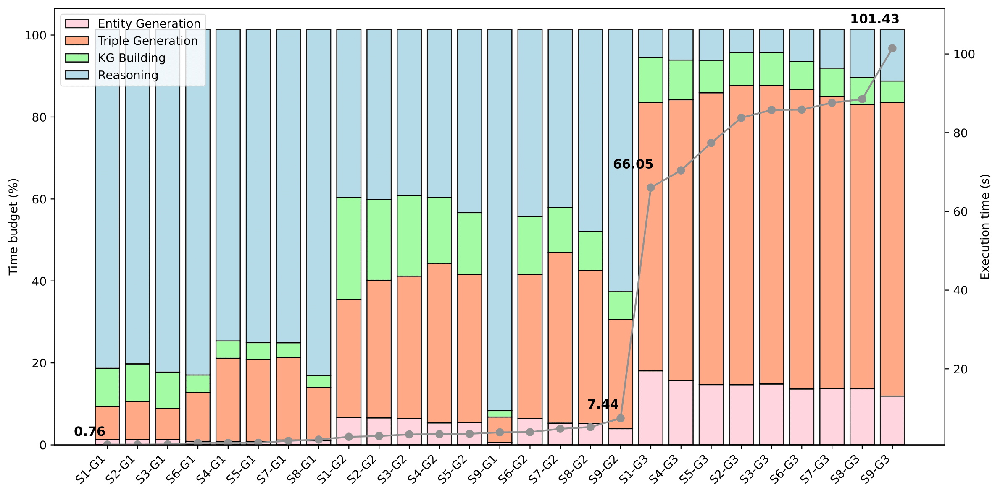

.. _execution_time:

Execution Time
=====================================

The efficiency and scalability of PyGraft are benchmarked across several schema and graph configurations. Each schema specification reported in Table 1 is paired with each graph specification from Table 2. This leads to 27 distinct combinations.

In particular, schemas from :math:`\mathcal{S}1` to :math:`\mathcal{S}3` are small-sized, schemas from :math:`\mathcal{S}4` to :math:`\mathcal{S}6` are medium-sized, and schemas from :math:`\mathcal{S}7` to :math:`\mathcal{S}9` are of larger sizes. For each schema of a given size, the degree of constraints vary as they contain different levels of OWL and RDFS constructs. For example, :math:`\mathcal{S}1` has less constraints than :math:`\mathcal{S}2`, which itself has less constraints than :math:`\mathcal{S}3`.
Graph specifications :math:`\mathcal{G}1`, :math:`\mathcal{G}2`, and :math:`\mathcal{G}3` correspond to small-sized, medium-sized and large-sized graphs, respectively.

For these 27 unique configurations, execution times w.r.t. several dimensions are computed and shown in Figure 3. Execution times related to the schema generation are omitted as they are negligible. 
Experiments were conducted on a machine with 2 CPUs Intel Xeon E5-2650 v4, 12 cores/CPU, and 128GB RAM.
   
.. list-table:: Table 1. Generated schemas. Column headers from left to right: number of classes, class hierarchy depth, average class depth, proportion of class disjointness (cd), number of relations, average depth of relation domains and ranges (rs), and proportions of reflexive (rf), irreflexive (irr), asymmetric (asy), symmetric (sy), transitive (tra), and inverse (inv) relations.
   :header-rows: 1
   :align: center

   * - 
     - :math:`|\mathcal{C}|`
     - :math:`\operatorname{MAX}(\mathcal{D})`
     - :math:`\operatorname{AVG}(\mathcal{D})`
     - cd
     - :math:`|\mathcal{R}|`
     - rs
     - ref
     - irr
     - asy
     - sym
     - tra
     - inv
   * - :math:`\mathcal{S}1`
     - :math:`25`
     - :math:`3`
     - :math:`1.5`
     - :math:`0.1`
     - :math:`25`
     - :math:`1.5`
     - :math:`0.1`
     - :math:`0.1`
     - :math:`0.1`
     - :math:`0.1`
     - :math:`0.1`
     - :math:`0.1`
   * - :math:`\mathcal{S}2`
     - :math:`25`
     - :math:`3`
     - :math:`1.5`
     - :math:`0.2`
     - :math:`25`
     - :math:`1.5`
     - :math:`0.2`
     - :math:`0.2`
     - :math:`0.2`
     - :math:`0.2`
     - :math:`0.2`
     - :math:`0.2`
   * - :math:`\mathcal{S}3`
     - :math:`25`
     - :math:`3`
     - :math:`1.5`
     - :math:`0.3`
     - :math:`25`
     - :math:`1.5`
     - :math:`0.3`
     - :math:`0.3`
     - :math:`0.3`
     - :math:`0.3`
     - :math:`0.3`
     - :math:`0.3`
   * - :math:`\mathcal{S}4`
     - :math:`100`
     - :math:`4`
     - :math:`2.5`
     - :math:`0.1`
     - :math:`100`
     - :math:`2.5`
     - :math:`0.1`
     - :math:`0.1`
     - :math:`0.1`
     - :math:`0.1`
     - :math:`0.1`
     - :math:`0.1`
   * - :math:`\mathcal{S}5`
     - :math:`100`
     - :math:`4`
     - :math:`2.5`
     - :math:`0.2`
     - :math:`100`
     - :math:`2.5`
     - :math:`0.2`
     - :math:`0.2`
     - :math:`0.2`
     - :math:`0.2`
     - :math:`0.2`
     - :math:`0.2`
   * - :math:`\mathcal{S}6`
     - :math:`100`
     - :math:`4`
     - :math:`2.5`
     - :math:`0.3`
     - :math:`100`
     - :math:`2.5`
     - :math:`0.3`
     - :math:`0.3`
     - :math:`0.3`
     - :math:`0.3`
     - :math:`0.3`
     - :math:`0.3`
   * - :math:`\mathcal{S}7`
     - :math:`250`
     - :math:`5`
     - :math:`3.0`
     - :math:`0.1`
     - :math:`250`
     - :math:`3.0`
     - :math:`0.1`
     - :math:`0.1`
     - :math:`0.1`
     - :math:`0.1`
     - :math:`0.1`
     - :math:`0.1`
   * - :math:`\mathcal{S}8`
     - :math:`250`
     - :math:`5`
     - :math:`3.0`
     - :math:`0.2`
     - :math:`250`
     - :math:`3.0`
     - :math:`0.2`
     - :math:`0.2`
     - :math:`0.2`
     - :math:`0.2`
     - :math:`0.2`
     - :math:`0.2`
   * - :math:`\mathcal{S}9`
     - :math:`250`
     - :math:`5`
     - :math:`3.0`
     - :math:`0.3`
     - :math:`250`
     - :math:`3.0`
     - :math:`0.3`
     - :math:`0.3`
     - :math:`0.3`
     - :math:`0.3`
     - :math:`0.3`
     - :math:`0.3`
   
.. list-table:: Table 2. Different graph specifications. Column headers from left to right: number of entities, number of triples, proportion of untyped entities, average depth of the most specific specific class, average number of most-specific classes per multi-typed entity.
   :header-rows: 1
   :align: center

   * - 
     - :math:`|\mathcal{E}|`
     - :math:`|\mathcal{T}|`
     - unt
     - asc
     - mul
   * - :math:`\mathcal{G}_1`
     - :math:`100`
     - :math:`1,000`
     - :math:`0.3`
     - :math:`2.0`
     - :math:`2.0`
   * - :math:`\mathcal{G}_2`
     - :math:`1,000`
     - :math:`10,000`
     - :math:`0.3`
     - :math:`2.0`
     - :math:`2.0`
   * - :math:`\mathcal{G}_3`
     - :math:`10,000`
     - :math:`100,000`
     - :math:`0.3`
     - :math:`2.0`
     - :math:`2.0`

|

   Figure 3: Execution time results