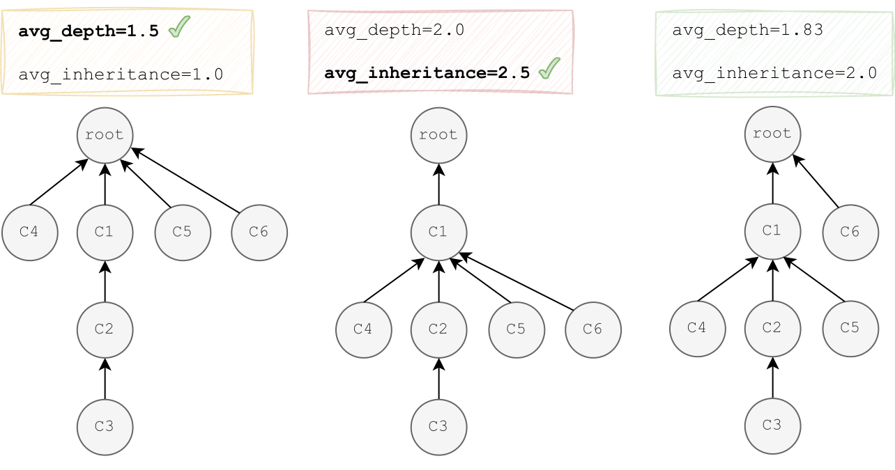

.. _first_steps:

First Steps
============

Once installed, PyGraft can be loaded with:

.. code-block:: python

    >>> import pygraft

Importantly, you can access all the functions with:

.. code-block:: python

    >>> pygraft.__all__
    ['create_template',
    'create_json_template',
    'create_yaml_template',
    'generate_schema',
    'generate_kg',
    'generate']

When generating a schema and/or a KG, the output files will be stored in ``output/`` (relative to the current directory). 
Under ``output/``, schemas as well as associated KGs are further stored in a distinct folder.
By default, the name of such folders correspond to the value for the ``schema_name`` parameter, which can be modified in the configuration file (see below).

Generating a Schema
---------------------

Let us assume we are only interested in generating a schema. We first need to retrieve the template configuration file (*e.g.* a ``.yaml`` configuration file), which is as simple as calling ``create_yaml_template()``:

.. code-block:: python

    >>> pygraft.create_yaml_template()

Now, the template has been generated under the current working directory, and is named ``template.yml`` by default. Let us inspect the file:

.. literalinclude:: template.yml
   :language: yaml

This file contains all the tunable parameters. For more details on their meanings, please check the :doc:`../references/parameters` section.

For now, we do not plan to modify this template and stick with the default parameter values. Refer to the :doc:`advanced` section for more detailed examples.

Generating an ontology is made possible via the ``generate_schema(path)`` function, which only requires the relative path to the configuration file.

.. note::
    For the following steps, i.e. generating a schema and a KG, you need Java to be installed and the $JAVA_HOME environment variable to be properly assigned. This is because the HermiT reasoner currently runs using Java.

In our case, the configuration file is named ``template.yml`` and is located in the same directory, thereby:

.. code-block:: python

    >>> pygraft.generate_schema("template.yml")

      ____      __   __    ____      ____         _        _____    _____   
    U|  _"\ u   \ \ / / U /"___|u U |  _"\ u  U  /"\  u   |" ___|  |_ " _|  
    \| |_) |/    \ V /  \| |  _ /  \| |_) |/   \/ _ \/   U| |_  u    | |    
     |  __/     U_|"|_u  | |_| |    |  _ <     / ___ \   \|  _|/    /| |\   
     |_|          |_|     \____|    |_| \_\   /_/   \_\   |_|      u |_|U   
     ||>>_    .-,//|(_    _)(|_     //   \\_   \\    >>   )(\\,-   _// \\_  
    (__)__)    \_) (__)  (__)__)   (__)  (__) (__)  (__) (__)(_/  (__) (__) 

    Ontology Generated.
    ===================
    Ontology Parameters:
    ===================

    +-------------------------+-------+-----------------+
    |      Class Metric       | Value | Specified Value |
    +-------------------------+-------+-----------------+
    |    Number of Classes    |  50   |       50        |
    | Maximum Hierarchy Depth |   4   |        4        |
    |   Average Class Depth   | 2.52  |       2.5       |
    | Class Inheritance Ratio | 2.05  |       2.0       |
    |  Average Disjointness   |  0.3  |       0.3       |
    +-------------------------+-------+-----------------+

    +-----------------------------+-------+-----------------+
    |       Relation Metric       | Value | Specified Value |
    +-----------------------------+-------+-----------------+
    |     Number of Relations     |  50   |       50        |
    |   SubProperty Proportion    | 0.32  |       0.3       |
    |     Reflexive Relations     |  0.3  |       0.3       |
    |    Irreflexive Relations    |  0.0  |       0.0       |
    |    Functional Relations     |  0.0  |       0.0       |
    | InverseFunctional Relations |  0.0  |       0.0       |
    |     Symmetric Relations     |  0.3  |       0.3       |
    |    Asymmetric Relations     |  0.0  |       0.0       |
    |    Transitive Relations     |  0.1  |       0.1       |
    |     InverseOf Relations     | 0.32  |       0.3       |
    |     Profiled Relations      | 0.94  |       0.9       |
    |    Relation Specificity     |  2.5  |       2.5       |
    +-----------------------------+-------+-----------------+

    Writing classes: 100% 50/50 [00:00<00:00, 1224.05classes/s]
    Writing relations: 100% 50/50 [00:00<00:00, 1194.00relations/s]
    
    Schema created.

    Consistent schema.

The output above highlights important facts:

- the first two tables compare the user requirements w.r.t. the schema with the actual values of the generated schema. In most cases, the generated schemas match very well with the user-specified parameters. 
  Situations in which this would not be the case are when users specify parameter values that conflict. For instance, asking for a ``max_hierarchy_depth`` which is lower than the ``avg_class_depth`` is not possible.
  Other sources of incomplete matching with the configuration file could happen if, for example, the following parameter values are specified: ``num_classes = 6``, ``max_hierarchy_depth = 3``, and ``inheritance_ratio = 2.5``.
  In this case, too many concurrent constraints are to be satisfied simultaneously, which can result in the different situations depicted in Figure 2.
- After the schema is created, its semantic consistency is checked using the HermiT reasoner from owlready2_. In this example, the schema is consistent. Note that over several hundreds of generated schemas during our experiments, PyGraft did not generate any inconsistent schema.

The generated schema can be retrieved in ``output/template/schema.rdf``. Additional files are created during the process: ``output/template/class_info.json`` and ``output/template/relation_info.json``.
These fils give important information about the classes and relations of the generated schema, respectively.

   Figure 2: Potential class hierarchies for the constraints num_classes = 6, max_hierarchy_depth = 3, and class_inheritance_ratio = 2.5. Left and middle class hierarchies are built with parameter priority. The right class hierarchy is built with a best-effort strategy, without specific parameter privilege.

Generating a KG
---------------------

Let us now explore how to use PyGraft to generate a KG. In this section, we assume we already have a schema, that will serve as a blueprint for generating our KG.
We can use the same configuration file as before -- as it also contained parameters related to the KG generation (although not used before, since we only asked for a schema) -- to generate a KG:

.. code-block:: python

    >>> pygraft.generate_kg("template.yml")

     ______          _______                   ___        
    (_____ \        (_______)                 / __)   _   
     _____) ) _   _  _   ___   ____  _____  _| |__  _| |_ 
    |  ____/ | | | || | (_  | / ___)(____ |(_   __)(_   _)
    | |      | |_| || |___) || |    / ___ |  | |     | |_ 
    |_|       \__  | \_____/ |_|    \_____|  |_|      \__)
            (____/                                       

    Writing instance triples: 100% 30000/30000 [00:01<00:00, 19830.78triples/s]

    Consistent KG.

And that's it! We now generated a KG containing 30K triples and roughly 3K distinct entities, as defined in ``template.yml``.
The generated KG can be retrieved in ``output/template/full_graph.rdf``.
It combines information inherited from ``output/template/schema.rdf`` (*i.e.* ontological information) with information related to individuals. Let us inspect its first few lines:

..
    .. literalinclude:: full_graph_truncated.rdf
    :language: rdf

.. code-block:: xml

   <?xml version="1.0" encoding="utf-8"?>
   <rdf:RDF
      xmlns:ns1="http://purl.org/dc/terms/"
      xmlns:owl="http://www.w3.org/2002/07/owl#"
      xmlns:rdf="http://www.w3.org/1999/02/22-rdf-syntax-ns#"
      xmlns:rdfs="http://www.w3.org/2000/01/rdf-schema#"
      xmlns:sc="http://pygraf.t/"
   >
     <rdf:Description rdf:about="http://pygraf.t/E1810">
       <rdf:type rdf:resource="http://pygraf.t/C21"/>
       <sc:R47 rdf:resource="http://pygraf.t/E622"/>
       <sc:R12 rdf:resource="http://pygraf.t/E447"/>
       <sc:R32 rdf:resource="http://pygraf.t/E761"/>
       <sc:R32 rdf:resource="http://pygraf.t/E4"/>
     </rdf:Description>
     <rdf:Description rdf:about="http://pygraf.t/C21">
       <rdf:type rdf:resource="http://www.w3.org/2002/07/owl#Class"/>
       <rdfs:subClassOf rdf:resource="http://pygraf.t/C37"/>
       <owl:disjointWith rdf:resource="http://pygraf.t/C11"/>
     </rdf:Description>
     <rdf:Description rdf:about="http://pygraf.t/R47">
       <rdf:type rdf:resource="http://www.w3.org/2002/07/owl#ObjectProperty"/>
       <owl:inverseOf rdf:resource="http://pygraf.t/R50"/>
     </rdf:Description>
   </rdf:RDF>

The above displayed RDF graph is easily readable: for instance, entity E1810 is linked to entity E622 via the relation R47 (inverse of relation R50).
We also know that E1810 is of type C21, which is both disjoint with C11 and a subclass of C37.

Full Pipeline Execution
---------------------

In most cases, one wants to generate *both* a schema and a KG in a single process. PyGraft allows this with the ``generate(path)`` function, which operates just as the aforedescribed two functions ``generate_schema(path)`` and ``generate_kg(path)``:

.. code-block:: python

    >>> pygraft.generate("template.yml")

    ,---.   .-.   .-.  ,--,   ,---.      .--.    ,---.  _______ 
    | .-.\   \ \_/ )/.' .'    | .-.\    / /\ \   | .-' |__   __|
    | |-' )   \   (_)|  |  __ | `-'/   / /__\ \  | `-.   )| |   
    | |--'     ) (   \  \ ( _)|   (    |  __  |  | .-'  (_) |   
    | |        | |    \  `-) )| |\ \   | |  |)|  | |      | |   
    /(        /(_|    )\____/ |_| \)\  |_|  (_)  )\|      `-'   
    (__)      (__)    (__)         (__)          (__)            

    Ontology Generated.
    ===================
    Ontology Parameters:
    ===================

    +-------------------------+-------+-----------------+
    |      Class Metric       | Value | Specified Value |
    +-------------------------+-------+-----------------+
    |    Number of Classes    |  50   |       50        |
    | Maximum Hierarchy Depth |   4   |        4        |
    |   Average Class Depth   | 2.52  |       2.5       |
    | Class Inheritance Ratio | 1.95  |       2.0       |
    |  Average Disjointness   |  0.3  |       0.3       |
    +-------------------------+-------+-----------------+

    +-----------------------------+-------+-----------------+
    |       Relation Metric       | Value | Specified Value |
    +-----------------------------+-------+-----------------+
    |     Number of Relations     |  50   |       50        |
    |   SubProperty Proportion    | 0.32  |       0.3       |
    |     Reflexive Relations     |  0.3  |       0.3       |
    |    Irreflexive Relations    |  0.0  |       0.0       |
    |    Functional Relations     |  0.0  |       0.0       |
    | InverseFunctional Relations |  0.0  |       0.0       |
    |     Symmetric Relations     |  0.3  |       0.3       |
    |    Asymmetric Relations     |  0.0  |       0.0       |
    |    Transitive Relations     |  0.1  |       0.1       |
    |     InverseOf Relations     | 0.32  |       0.3       |
    |     Profiled Relations      | 0.91  |       0.9       |
    |    Relation Specificity     | 2.47  |       2.5       |
    +-----------------------------+-------+-----------------+

    Writing classes: 100% 50/50 [00:00<00:00, 800.84classes/s] 
    Writing relations: 100% 50/50 [00:00<00:00, 1492.49relations/s]
    
    Schema created.

    Consistent schema.

    Writing instance triples: 100% 30000/30000 [00:01<00:00, 28517.72triples/s]

    Consistent KG.

.. _owlready2: https://github.com/pwin/owlready2/